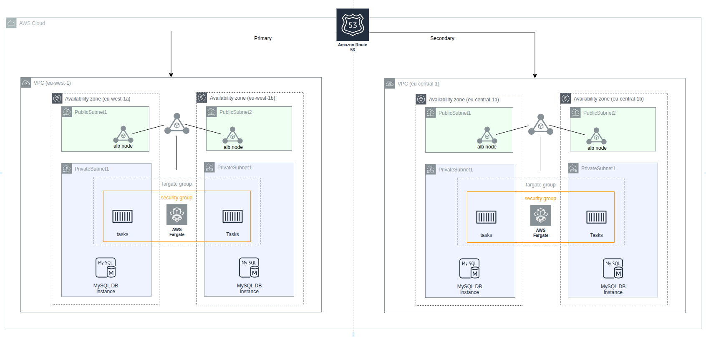

# phpMySQLapp

A sample LAMP based web service stack for managing books and movies.

LAMP stack is a popular open source web platform commonly used to run dynamic web sites and servers.
It includes Linux, Apache, MySQL, and PHP and is considered by many the platform of choice for development
and deployment of high performance web applications which require a solid and reliable foundation.


## Architecture



## Features

- Book and movie catalog management
- Search functionality
- Filter by genre, country, director/author, and year
- Responsive web interface

## SETTING UP DATABAE

Database can be set up locally with a mysql docker container or Amazon rds. The database should be seeded with the scripts located in ```mySqlDB/*```

## Environment Variables

- `DB_SERVERNAME`: Database server hostname
- `DB_NAME`: Database name (default: book_movie_db)
- `DB_PASSWORD`: Database password

## Running with Docker

### Build the image

```bash
docker build -t phpapp .
```

### Run locally

For example;

```bash
docker run -dp 3000:80 \
-e DB_SERVERNAME=owbyproject.c1wke6cc8q8b.eu-west-1.rds.amazonaws.com \
-e DB_NAME=book_movie_db \
-e DB_PASSWORD=password123 \
-e DB_USER=root \
phpapp
```

### Access the application

Open <http://localhost:3000> in your browser

## Database Schema

The application uses two main tables:

- `books`: Book catalog with authors and categories
- `films`: Movie catalog with directors and genres

## Deploying with AWS Copilot

1. Install AWS Copilot CLI
2. Change directory into cloned folder and run `copilot init`
3. Follow prompts to set it up

**Note**: Service deploys to ECS with a load balancer

## Disaster Recovery

This application implements a multi-region disaster recovery strategy using AWS Copilot, Route 53 DNS failover, and RDS cross-region replication. 

For detailed information about the disaster recovery setup, implementation steps, and lessons learned, see [Disaster_recovery_learnings.md](Disaster_recovery_learnings.md).
